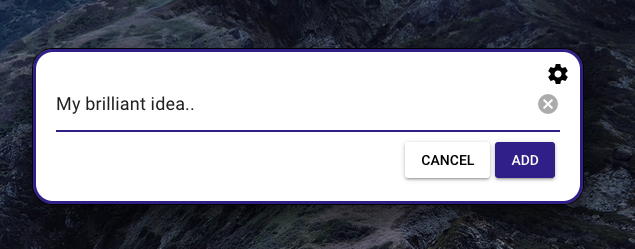

demo: https://vimeo.com/790940834

Install & Tips;

- Download, unzip and open
- Select the file you want to use with the settings icon

- Command + Option + O to show menu
- Escape/Click outside to hide the menu

Caveat's;

- Only for mac/only tested on mac
- Probably contains some bugs 🤷‍♂️
